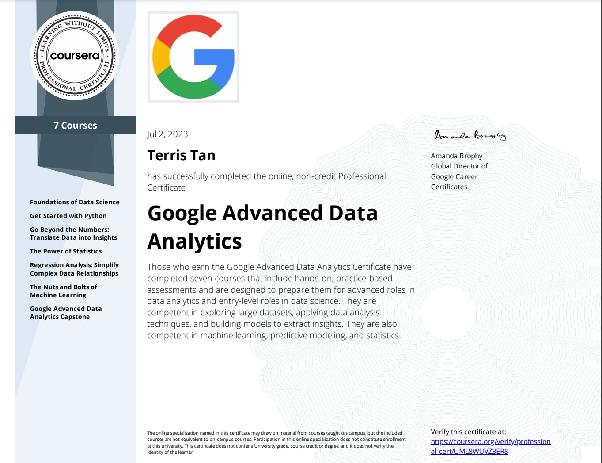

## [Google Advanced Data Analytics Professional Certificate](https://www.coursera.org/programs/smu-software-engineering-wsdeg-uhmy4/professional-certificates/google-advanced-data-analytics)

 

 

### About this Professional Certificate

Get professional training designed by Google and take the next step in your career with advanced data analytics skills. **There are over 144,000 open jobs in advanced data analytics and the median salary for entry-level roles is $118,000.**

**Advanced data professionals** are responsible for collecting, analyzing, and interpreting extremely large amounts of data. These jobs require manipulating large data sets and using advanced analytics including machine learning, predictive modeling, and experimental design.

This certificate builds on your data analytics skills and experience to take your career to the next level. It's designed for graduates of the
Google Data Analytics Certificate or people with equivalent data analytics experience. Expand your knowledge with practical, hands-on projects, featuring Jupyter Notebook, Python, and Tableau.

After seven courses, you’ll be prepared for jobs like senior data analyst, junior data scientist, data science analyst, and more. At under 10 hours a week, the certificate program can be completed in less than six months. Upon completion, you can apply for jobs with Google and over 150 U.S. employers, including Deloitte, Target, and Verizon.

---

### Applied Learning Project

This program includes over 200 hours of instruction and hundreds of practice-based assessments, which will help you simulate real-world advanced data analytics scenarios that are critical for success in the workplace. The content is highly interactive and exclusively developed by Google employees with decades of experience in advanced data analytics and data science. Through a mix of videos, assessments, and hands-on labs, you’ll get introduced to advanced data analytics tools and platforms and key technical skills required for an advanced role.

**Platforms and tools you will learn include:** Jupyter Notebook, Python, Tableau

In addition to expert training and hands-on projects, you'll complete a capstone project that you can share with potential employers to showcase your new skill set. Learn concrete skills that top employers are hiring for right now.

---

## What you will learn

- Explore the roles of data professionals within an organization
- Create data visualizations and apply statistical methods to investigate data
- Build regression and machine learning models to analyze and interpret data
- Communicate insights from data analysis to stakeholders

---

## Skills you’ll gain:

|        **Business**        |         **Data**         |       **Programming**       |        **Computer Science**        |
| :------------------------: | :----------------------: | :-------------------------: | :--------------------------------: |
|     Business Analysis      |      Data Analysis       |    Software Engineering     |    Theoretical Computer Science    |
|    Research and Design     |    Data Visualization    |      Software Testing       |     Computer Programming Tools     |
|          Planning          |     Data Management      |   Programming Principles    |          Data Structures           |
|      Market Research       |    General Statistics    |    Computer Programming     |       Computer Architecture        |
|  Strategy and Operations   | Probability & Statistics |     Python Programming      | Distributed Computing Architecture |
| Supply Chain and Logistics | Probability Distribution |      Machine Learning       |         Critical Thinking          |
|      Entrepreneurship      |        Regression        | Machine Learning Algorithms |         Operating Systems          |
| Leadership and Management  |   Bayesian Statistics    |       Computer Vision       |                                    |
|   Business Communication   | Statistical Programming  |                             |                                    |
|                            |                          |                             |                                    |
